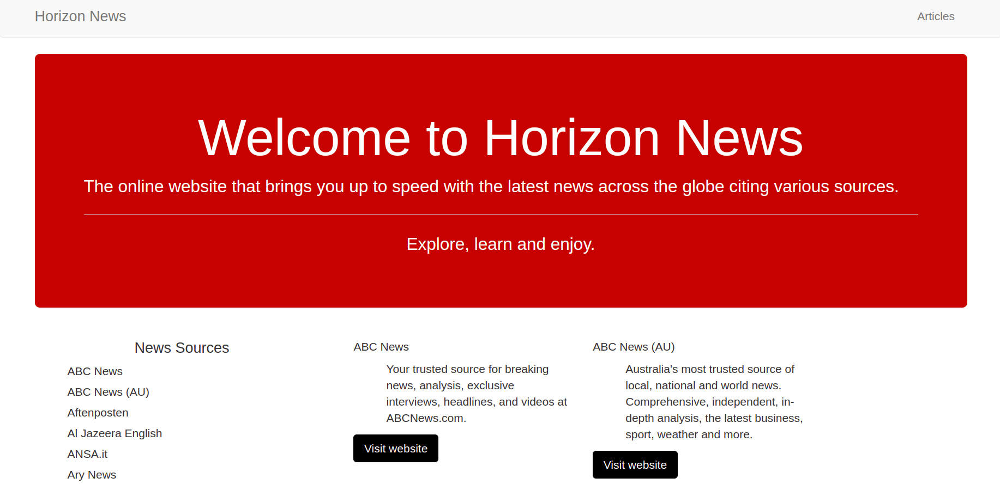

# HORIZON-NEWS

Horizon News is a news web application.
This application helps user to read news and keep up with current trends from across various news sources.

# App screenshot

## Installation

Guide to install Horizon News application:

### Clone this repository
```bash
 git clone https://github.com/John-Kimani/Horizon-News.git
```
* Move into the cloned directory:
```bash
cd Horizon-NEWS
```
* Create and activate your virtual environment:
```bash
mkvirtualenv virtual
```
* Install project dependancies within your active environment: (Read: requirements.txt and use command below)
```bash
(virtual)$ pip3 Install -r requirements.txt
```
* Environment variables:
    *  Create a file called ```.env``` in the root folder
    ```bash
    (virtual)$ touch .env
    ```
    * Add the following lines to the file as seen in ```.env-template```
    ```bash 
    NEWS_SOURCE_URL=
    NEWS_ARTICLE_API_URL=
    NEWS_APIKEY=
    ```
* Start the flask server
```bash
(Virtual)$ flask run
```
* or

```bash
(Virtual)$ python3 run.py
```
## Features and BDD

- Users navigation across the app.
- Users can access various news sources and read more about articles on sources website 


## Technology Used

**Framework:** Flask
**Language** Python

### Developed with
**Structure:** Bootstrap, HTML
**Styles:** CSS

## Author

* Design and developed by: [John Kimani](https://github.com/John-Kimani)
